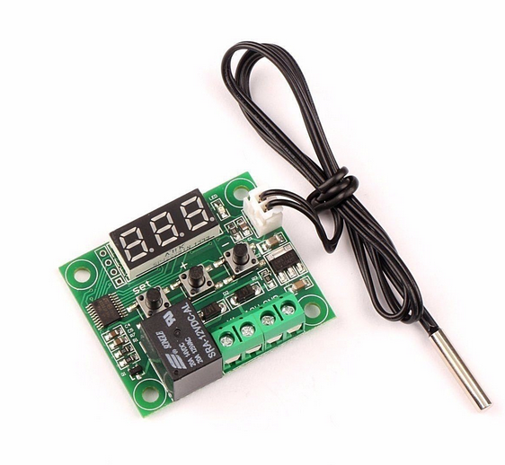

# Digital temperature controller XH-W1209

### Specs

- Spanning: 12V DC
- Stroomverbruik: <35mA (idle), <65mA(relais geschakeld)
- Spanning relais (max): 30V
- Stroom relais (max): 10A
- Temperatuurbereik: -50°C - 110°C
- NTC type: 10K 0.5%
- NTC connector: JST-XH
- Aansluiting 12V: +12V en GND (schroef terminal)
- Aansluiting schakeldraad via relais: K0 en K1 (schroef terminal)
- Afmetingen: 48.5 x 40.1 x 15.8mm
- Type module: XH-WH1209

### Instructions

When you power on the board, it displays the current temperature. Press the SET button to set the temperature at which the relay will switch on.

In addition to simply setting the temperature at which the relay turns on your device, you can set nine parameters that are not apparent to a casual user. These are labeled P0 through P8. To access these options, press and hold the SET button for 5 seconds.

Code Indication Set range Inital Setting
P0 Cooling/Heating H/C C
P1 Hysteresis 0.5-15℃ 2
P2 High limit 110℃ 110
P3 Low limit -50℃ -50
P4 Temp. adjust -07 to 7℃ 0
P5 Delay start time 0 -10 min. 0
P6 Alarm on/off on
P7 High temp. alarm 0 -110 ℃ off
P8 Initial setting on/off off

Detailed instructions:

Press SET for 5 seconds to enter the main menu settings.
Press the + or – button to cycle through registers P0 – P8.
Press SET again to view the stored value.
Press + or – to change the stored value.
Press SET again to save the new value and return to the P0-P8 list.
The controller will return to normal mode if no button is pressed for 10 seconds.

P0 – Sets cooling vs. heating mode.
– In cooling mode, the relay engages when temperature rises past the set point.
– In heating mode, the relay engages when temperature decreases past the set point.

P1 – Hysteresis (return difference)
– Hysteresis is the difference in temperature between when the relay engages and when it shuts back off.
– This keeps the relay from constantly cycling on and off with small changes in temperature.

Example: You want to turn on a fan when the temperature rises above 30 degrees. If Hysteresis was set to zero, the fan would come on at 30C, turn back off at 29.9C, and then back on at 30C – constantly cycling your load. With hysteresis set to 2, the fan will come on at 30C, turn off at 28C, and then come back on again at 30C. This gives your fan a chance to adequately cool the device you are measuring.
In heating mode, the fan would come on at 30C, turn off at 32C, then on again at 30C.

P2 – Maximum temperature a user is allowed to set.
P3 – Minimum temperature a user is allowed to set.

What confused me in the Chinese instructions:
P2 and P3 do NOT set the relay control point. These parameters set the temperature limits displayed to your end user when they press the SET button. This lets you limit the temperature range your end user can control.

For example, you may want to limit your end user to only control the temperature of a cooler between 0C and 10C. Set P2 to 10 and P3 to 0. When your end user presses the SET button, they can only change the setpoint between 0 and 10.

P4 – Temperature correction/calibration

Use this to correct the temperature displayed by this unit when compared to a calibrated thermometer of known value. This setting can usually be left at the default value of 0C. An offset of -7C to +7C can be applied to the displayed temperature value.

P5 – Delayed start time. Unit = minutes from 0 to 10. Set to 0 to disable.
Delay relay operation on initial power-up by this number of minutes. This can help provide time for compressor delay, temperature stabilization, etc.

P6 – Key tone switch (Note: This setting does not work on my W1209 Ver 1.2)

P7 – Temperature alarm
On units with a buzzer, this setting triggers an audible alert. In cooling mode, the alert sounds when the measured temperature is at or below the value set in P7. In heating mode, the alert sounds when the measured temperature is at or above the value set in P7.

P8 – Restore factory settings (Not working on my W1209 Ver 1.2. Toggles between C & H)
