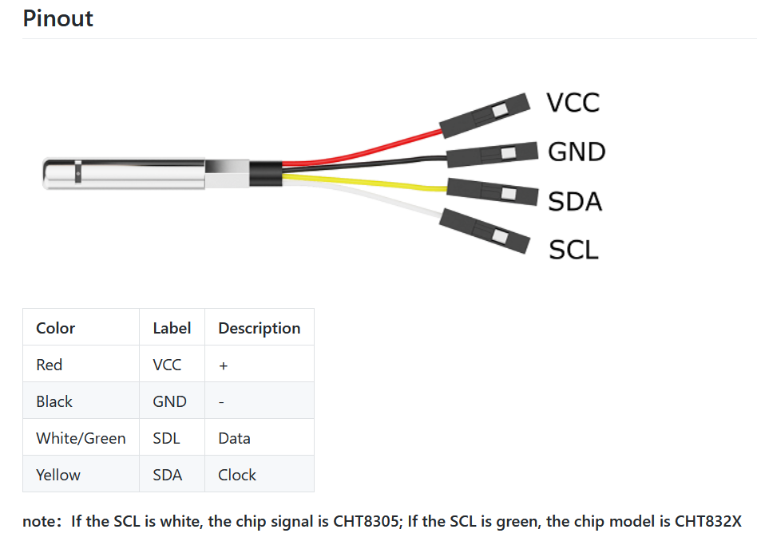

# DFRobot CHT8305 Temperature and Humidity

- [Arduino library](https://github.com/RobTillaart/CHT8305)
- [documentation DFRobot](https://wiki.dfrobot.com/SKU_SEN0546_I2C_Temperature_and_Humidity_Sensor_Stainless_Steel_Shell)

### Pinout

